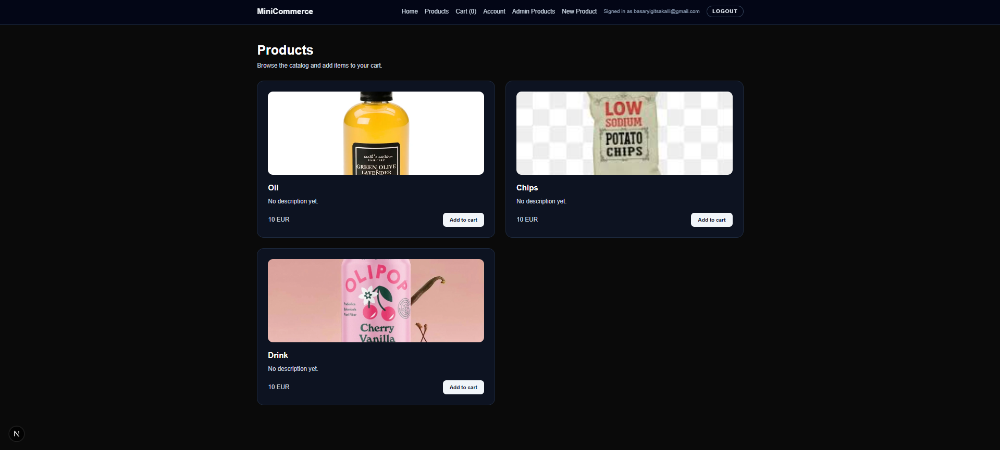
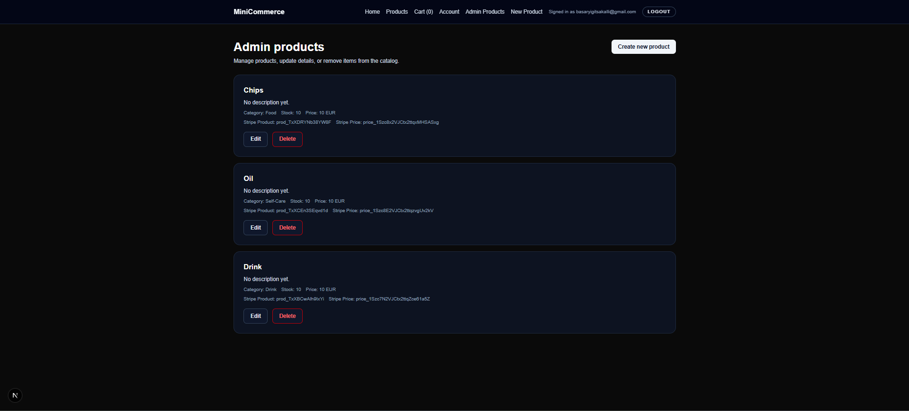
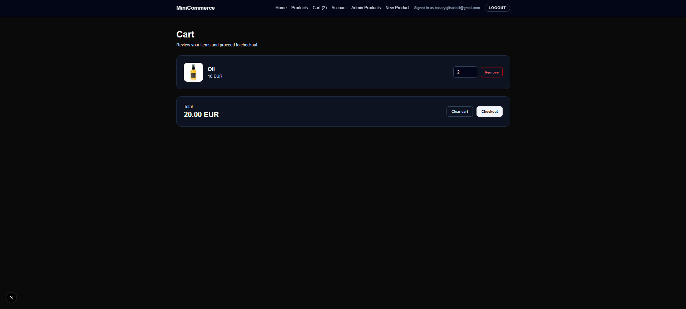

# Ecom Next (E-commerce Demo)

A Next.js e-commerce demo with Firebase authentication, admin-only product management, and Stripe checkout.

## Features
- Email/password authentication with Firebase
- Admin-only product creation and management (Firestore)
- Product listing and cart flow
- Stripe checkout session redirect

## Tech Stack
- Next.js (App Router)
- React, TypeScript
- Tailwind CSS
- Firebase (Auth + Firestore)
- Stripe API

## Environment Variables
Create a `.env.local` file with:

```
NEXT_PUBLIC_FIREBASE_API_KEY=
NEXT_PUBLIC_FIREBASE_AUTH_DOMAIN=
NEXT_PUBLIC_FIREBASE_PROJECT_ID=
NEXT_PUBLIC_FIREBASE_STORAGE_BUCKET=
NEXT_PUBLIC_FIREBASE_MESSAGING_SENDER_ID=
NEXT_PUBLIC_FIREBASE_APP_ID=
STRIPE_SECRET_KEY=
NEXT_PUBLIC_APP_URL=http://localhost:3000
```

## Run Locally
```bash
npm install
npm run dev
```

## Possible Improvements
- Add order history and user profile page
- Add product search/filter and pagination
- Add webhook-based Stripe payment confirmation

## Screenshots



